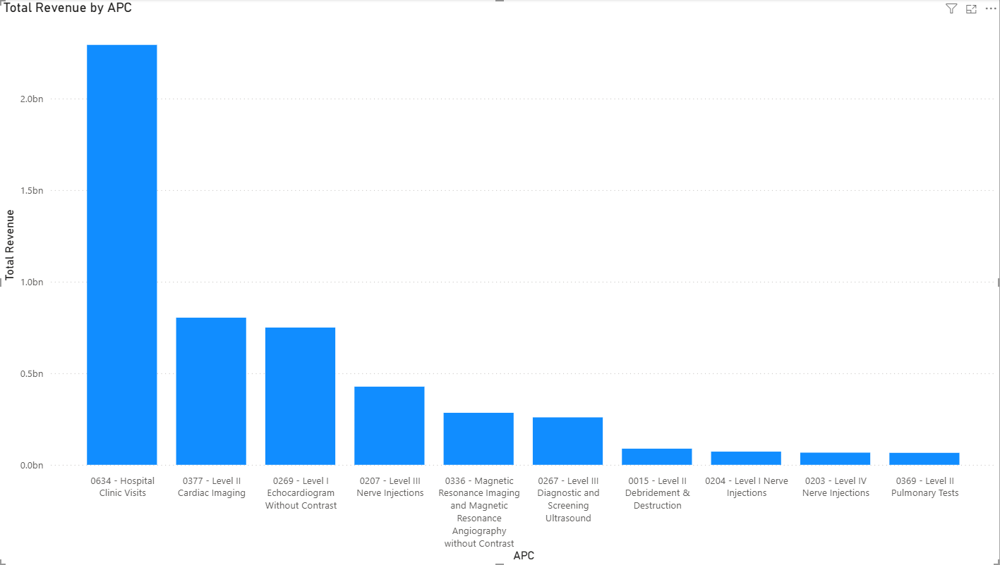
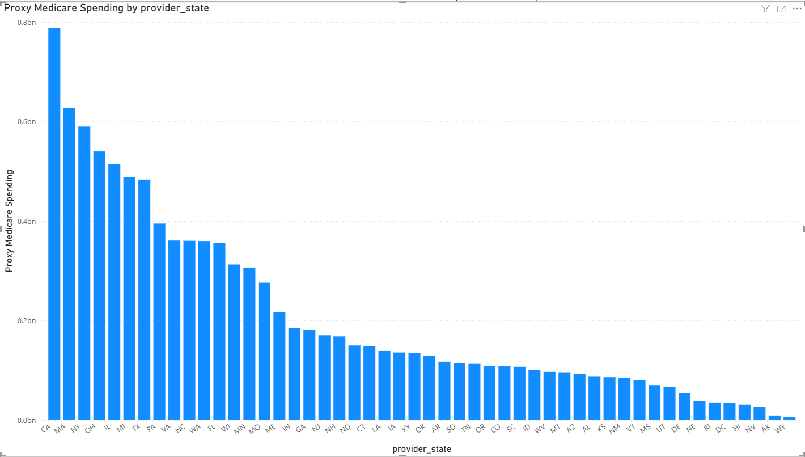
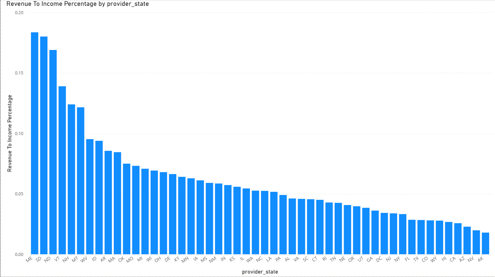

# SQL Project: Medicare Outpatient Payments Analysis (2015)

## Overview
This project analyzes the **2015 CMS Medicare Outpatient Charges dataset** using **SQL (BigQuery)** and **Power BI**.  
The goal is to:
- Explore outpatient service utilization patterns
- Compare provider payments across states
- Estimate proxy Medicare payments (assuming 80% Medicare / 20% out-of-pocket split)
- Evaluate the relative economic footprint of hospital spending versus state total income

---

## Data

- **CMS Medicare Public Data**  
  - Table: `bigquery-public-data.cms_medicare.outpatient_charges_2015`  
- **U.S. Census Bureau ACS (2015)**  
  - Table: `bigquery-public-data.census_bureau_acs.state_2015_1yr`  

**Note:**
`average_total_payments` includes Medicare payments **plus** patient cost-sharing (deductible/copay).  
To approximate Medicare-only payments, a **0.8 multiplier (80%)** is applied as a proxy assumption.

**Note:**
The Census ACS dataset uses `geo_id` values, which are state-level FIPS codes.  
For this project, the two-digit FIPS codes were mapped to standard two-letter state abbreviations (e.g., `01` → `AL`, `06` → `CA`).  
This step ensured consistency when joining the ACS dataset with the Medicare outpatient spending data by state.

---

## Analysis Steps

1. **Exploratory Data Analysis (EDA)**  
   - Previewed table schema and row counts  

2. **Top Outpatient Services (APC codes)**  
   - Identified top 10 services by claim volume  
   - Calculated weighted average payment per claim

**Note:**  
APC stands for *Ambulatory Payment Classification*, the system Medicare uses to group and reimburse outpatient hospital services. Each APC corresponds to a category of services with similar clinical and cost characteristics.

3. **State-Level Proxy Medicare Spending**  
   - Computed weighted averages and proxy Medicare payments  

4. **Spending vs Total Income**  
   - Estimated total personal income = population × income per capita  
   - Compared proxy Medicare spending as % of total income  

---

## Example Queries

### 1. Exploratory Data Analysis
```sql
SELECT *
FROM `bigquery-public-data.cms_medicare.outpatient_charges_2015`
LIMIT 10;

SELECT COUNT(*) AS total_rows
FROM `bigquery-public-data.cms_medicare.outpatient_charges_2015`;
```

### 2. Top 10 Services by Total Revenue
```sql
SELECT
  apc,
  SUM(outpatient_services) AS num_claims,
  ROUND(
    SAFE_DIVIDE(
      SUM(outpatient_services * average_total_payments),
      NULLIF(SUM(outpatient_services), 0)
    ), 2
  ) AS avg_payment_per_claim,
  ROUND(
    SUM(outpatient_services * average_total_payments), 2
  ) AS total_outpatient_payments
FROM `bigquery-public-data.cms_medicare.outpatient_charges_2015`
GROUP BY apc
ORDER BY num_claims DESC
LIMIT 10;
```

### 3. Proxy Medicare Payments by State
```sql
WITH state_pay AS (
  SELECT
    provider_state,
    SUM(outpatient_services) AS claims,
    SUM(outpatient_services * average_total_payments) AS total_outpatient_payments
  FROM `bigquery-public-data.cms_medicare.outpatient_charges_2015`
  GROUP BY provider_state
)
SELECT
  provider_state,
  ROUND(
    SAFE_DIVIDE(total_outpatient_payments, NULLIF(claims, 0)), 2
  ) AS avg_total_payment_per_claim,
  ROUND(total_outpatient_payments * 0.80, 2) AS proxy_medicare_payments
FROM state_pay
ORDER BY proxy_medicare_payments DESC;
```

### 4. Proxy Medicare Spending vs Total Income
```sql
WITH acs_state AS (
  SELECT
    CASE
      WHEN geo_id = '01' THEN 'AL' WHEN geo_id = '02' THEN 'AK'
      WHEN geo_id = '04' THEN 'AZ' WHEN geo_id = '05' THEN 'AR'
      WHEN geo_id = '06' THEN 'CA' WHEN geo_id = '08' THEN 'CO'
      WHEN geo_id = '09' THEN 'CT' WHEN geo_id = '10' THEN 'DE'
      WHEN geo_id = '11' THEN 'DC' WHEN geo_id = '12' THEN 'FL'
      WHEN geo_id = '13' THEN 'GA' WHEN geo_id = '15' THEN 'HI'
      WHEN geo_id = '16' THEN 'ID' WHEN geo_id = '17' THEN 'IL'
      WHEN geo_id = '18' THEN 'IN' WHEN geo_id = '19' THEN 'IA'
      WHEN geo_id = '20' THEN 'KS' WHEN geo_id = '21' THEN 'KY'
      WHEN geo_id = '22' THEN 'LA' WHEN geo_id = '23' THEN 'ME'
      WHEN geo_id = '24' THEN 'MD' WHEN geo_id = '25' THEN 'MA'
      WHEN geo_id = '26' THEN 'MI' WHEN geo_id = '27' THEN 'MN'
      WHEN geo_id = '28' THEN 'MS' WHEN geo_id = '29' THEN 'MO'
      WHEN geo_id = '30' THEN 'MT' WHEN geo_id = '31' THEN 'NE'
      WHEN geo_id = '32' THEN 'NV' WHEN geo_id = '33' THEN 'NH'
      WHEN geo_id = '34' THEN 'NJ' WHEN geo_id = '35' THEN 'NM'
      WHEN geo_id = '36' THEN 'NY' WHEN geo_id = '37' THEN 'NC'
      WHEN geo_id = '38' THEN 'ND' WHEN geo_id = '39' THEN 'OH'
      WHEN geo_id = '40' THEN 'OK' WHEN geo_id = '41' THEN 'OR'
      WHEN geo_id = '42' THEN 'PA' WHEN geo_id = '44' THEN 'RI'
      WHEN geo_id = '45' THEN 'SC' WHEN geo_id = '46' THEN 'SD'
      WHEN geo_id = '47' THEN 'TN' WHEN geo_id = '48' THEN 'TX'
      WHEN geo_id = '49' THEN 'UT' WHEN geo_id = '50' THEN 'VT'
      WHEN geo_id = '51' THEN 'VA' WHEN geo_id = '53' THEN 'WA'
      WHEN geo_id = '54' THEN 'WV' WHEN geo_id = '55' THEN 'WI'
      WHEN geo_id = '56' THEN 'WY' WHEN geo_id = '72' THEN 'PR'
    END AS state,
    CAST(total_pop AS INT64) AS population,
    CAST(income_per_capita AS NUMERIC) AS income_per_capita
  FROM `bigquery-public-data.census_bureau_acs.state_2015_1yr`
),
state_pay AS (
  SELECT
    provider_state,
    SUM(outpatient_services * average_total_payments) AS total_outpatient_payments
  FROM `bigquery-public-data.cms_medicare.outpatient_charges_2015`
  GROUP BY provider_state
)
SELECT
  s.state,
  ROUND(sp.total_outpatient_payments * 0.80, 2) AS proxy_medicare_payments,
  ROUND(s.population * s.income_per_capita, 2) AS total_personal_income,
  ROUND(
    SAFE_DIVIDE(sp.total_outpatient_payments * 0.80, NULLIF(s.population * s.income_per_capita, 0)) * 100,
    4
  ) AS proxy_payments_to_income_pct
FROM state_pay sp
JOIN acs_state s
  ON sp.provider_state = s.state
ORDER BY proxy_payments_to_income_pct DESC;
```

## 📊 Key Insights

| State       | Proxy Payments-to-Income Ratio | Notes |
|-------------|--------------------------------|-------|
| **Maine (ME)**  | **0.22%** | Highest ratio → reflects older population & higher Medicare dependence |
| **Alaska (AK)** | **0.02%** | Lowest ratio → high average income, unique healthcare system |

- States with higher ratios → **greater economic burden of outpatient care**  
- States with lower ratios → **smaller relative footprint**, but may face **accessibility challenges**  
- Large states by population (e.g., California, Texas, New York) contribute the **highest total dollar spending**, but their ratios are lower due to bigger economic bases.  
- Smaller or rural states can show a **disproportionately high ratio**, even if their absolute spending is modest.  
- The ratio metric highlights not just spending, but the **relative strain of healthcare costs** on a state’s economy.

---

## 📊 Visualizations

### 1. Top 10 APCs by Claims


### 2. Proxy Medicare Spending by State


### 3. Revenue-to-Income Percentage by State


## Limitations

- **Incomplete State Coverage**  
  - Certain states (e.g., Maryland) are excluded from the dataset.  
  - Maryland is unique in operating under an **all-payer hospital rate-setting system**, where hospital reimbursement rates are regulated at the state level.  
  - Because of this structure, Maryland data is not included in the CMS Medicare Outpatient Charges dataset, and the analysis does not represent 100% of U.S. states.  

- **Proxy Calculation**  
  - The `average_total_payments` column includes not only Medicare reimbursements but also **copayments** and **deductibles**.  
  - This project assumes patient responsibility accounts for ~20%, and applies a proxy factor (0.8) to approximate Medicare-only spending. Actual values may differ.  

- **Time Scope**  
  - The dataset reflects **2015 data**. Demographics, cost structures, and Medicare reimbursement policies may have shifted significantly since then.  
  - For current relevance, the analysis should be replicated with more recent datasets.  

- **GDP Proxy**  
  - State-level economic comparison uses **population × income per capita** as a proxy for GDP.  
  - While this provides a rough benchmark, it is not equivalent to official GDP figures from the BEA (Bureau of Economic Analysis).  
  - Insights should be interpreted as **relative approximations** rather than precise economic ratios.  

